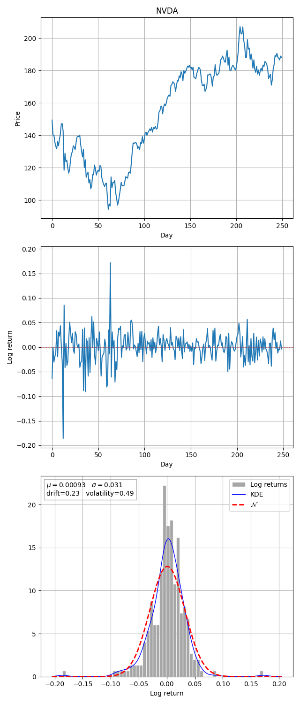

# Black-Scholes-Merton Model

Given:  
$\tau$ = time in years; with $\tau = 0$ generally representing the present year  
$T$ = time of option expiration in years  
$t$ = time to expiry in years; $t = T - \tau$  

$r$ = annualized risk-free interest rate, continuously compounded  

$S_\tau$ = Stock price at time $\tau$, $S_0$ on day $0$, $S_T$ at expiry  
$K$ = Strike price  

$C$ = Call price  
$P$ = Put price  

$\mu$ = drift rate of S, annualized  (_directional trend, not used in the formula_)  
$\sigma$ = historical volatility, standard deviation of the log returns of $S$, annualized  

$\Phi(x)$ = standard normal CDF (Cumulative Distribution Function)  

**Fixed**
* $K$

**Variable**
* $S_\tau$
* $\sigma$
* $t$
* $r$ (relatively constant)

## Call

$\boxed{C = \Phi(d1) \cdot S_t - \Phi(d2) \cdot e^{-rt} \cdot K}$

 **Interpretation**

* $\Phi(d1)$ reflects the risk-neutral expected value factor for receiving the stock above the strike (hedge ratio).
* $\Phi(d2)$ gives the risk-neutral probability that a call option finishes in-the-money ($S_T$ > K at expiration).

> Note: Option $\Delta=\Phi(d1)$

**Expiration**

$C = S_T - K$

**Present value**

$C = 1 \cdot S_\tau - e^{-rt} \cdot K$

**Probability of rate of return**

$C = \Phi(d1) \cdot 1 \cdot S_t - \Phi(d2) \cdot e^{-rt} \cdot K$

$\Phi(d1)$ and $\Phi(d2) \in [0,1]$, a probability factor or weight for the rate of return.

**Probability estimation**

$\Phi(d1)$ and $\Phi(d2) \in [0,1]$ estimated based on the $z$ score (standard score).  
$d_1$ and $d_2$ is the $z$ score, number of $\sigma$ away from the mean.  

|d   |-3 |-2 |-1 | 0 | +1| +2| +3|
|--- |---|---|---|---|---|---|---|
|$\Phi(d)$|0.0013|0.0228|0.1587|0.5|0.8413|0.9772|0.9987|

**$z$ score estimation**

$d_1 = \frac{\ln\left(\frac{S_\tau}{K}\right) + \left(r + \frac{\sigma^2}{2}\right)t}{\sigma\sqrt{t}}$

$d_2 = \frac{\ln\left(\frac{S_\tau}{K}\right) + \left(r - \frac{\sigma^2}{2}\right)t}{\sigma\sqrt{t}}
\quad OR \quad 
d_2 = d_1 - \sigma\sqrt{t}$

$z = \frac{x-\mu}{\sigma}$

$z = \frac{\text{required return - expected return}}{\text{volatility}}$

Required return rate to be ATM, exercise or buy today at $K$ and sell at $S_\tau$. Intrinsic value return rate.  
$\ln\left(\frac{S_\tau}{K}\right)$

Expected return rate, time value of money return rate.  
$\left(r + \frac{\sigma^2}{2}\right)t = \left(rt + \frac{\sigma^2}{2}t\right)$ 

Return rate volatility, scaled by time factor.  
$\sigma\sqrt{t}$

**Simplify the time effect**

Assume $t=1$, one year

$d_1 = \frac{\ln\left(\frac{S_\tau}{K}\right) + \left(r + \frac{\sigma^2}{2}\right)}{\sigma}$

$d_2 = \frac{\ln\left(\frac{S_\tau}{K}\right) + \left(r - \frac{\sigma^2}{2}\right)}{\sigma}
\quad OR \quad 
d_2 = d_1 - \sigma$

**Volatility effect**

$\sigma \to 0 \Rightarrow d1,d2 \to \pm \infty \Rightarrow \Phi(d) \in \{0,1\}$, implies it only depends on $\ln\left(\frac{S_t}{K}\right)$.

$\sigma \to \infty \Rightarrow d1,d2 \to 0 \Rightarrow \Phi(d)=0.5$, implies equal probability.

**Stock price effect**

ITM when $S_T > K$, $\ln\left(\frac{S_T}{K}\right) > 0$, $\text{as}\quad S_T \to +\infty \quad \ln\left(\frac{S_T}{K}\right) \to +\infty$

ATM when $S_T = K$, $\ln\left(\frac{S_T}{K}\right) = 0$

OTM when $S_T < K$, $\ln\left(\frac{S_T}{K}\right) < 0$, $\text{as}\quad S_T \to 0 \quad \ln\left(\frac{S_T}{K}\right) \to -\infty$

## Put

Using Put-Call parity

$\boxed{P = \Phi(-d2) \cdot K \cdot e^{-rt} - \Phi(-d1) \cdot S_t}$

## Appendix A - Log Returns

$\log_e(x)=r$   
$x=e^r$

Log returns  
$r_i = \ln(\frac{S_i}{K})$   
$\mu$ = mean  
$\sigma$ = standard deviation

Scale time factor  
$h = T/n$  
where:  
$T$ = total time  
$n$ = time period

Scaled mean  
$\mu_T = \mu \cdot h$

Scaled standard deviation  
$\sigma_T = \sigma \cdot \sqrt{h}$

## Appendix B - Historical Volatility
Given daily stock prices  
$S_1, S_2, S_3, \cdots S_n$ 

Log returns  
$r_i = \ln(\frac{S_i}{S_{i-1}})$   
$\mu$ = drift  
$\sigma$ = volatility

Volatility annualized, where _number of trading days_ = 252    
$\sigma_{annual} = \sigma \sqrt{252}$

**Example**

## Appendix C  - Put-Call Parity
Assumption:  
If this equation holds, the options market is in equilibrium, with no arbitrage prospects available.

Given:  
$S$ = Stock price (current)  
$C$ = Call price (current)  
$P$ = Put price (current)  
$D$ = Discount factor  
$F$ = Forward price of stock (future)  
$K$ = Strike price of stock (future)  

$C-P = D \cdot (F-K)$

$C-P = D\cdot F - D\cdot K$

$C-P = S - D\cdot K$

$\boxed{C-P = S - e^{-rt}K}$

For ATM option, $S=K$

$C-P = S - e^{-rt}S$

**Solving for $r$**

$C-P = S\left(1 - e^{-rt}\right)$

$\frac{C-P}{S} = 1 - e^{-rt}$

$e^{-rt} = 1 - \frac{C-P}{S}$

$\ln\left(e^{-rt}\right) = \ln\left(1 - \frac{C-P}{S}\right)$

$-rt \cdot ln(e) = \ln\left(1 - \frac{C-P}{S}\right)$

$-rt \cdot 1 = \ln\left(1 - \frac{C-P}{S}\right)$

$rt = -\ln\left(1 - \frac{C-P}{S}\right)$

For $t=1$, one year expiry

$r = -\ln\left(1 - \frac{C-P}{S}\right)$

**Interpretations**

$C + D \cdot K = P + S$  
Long Call + Bond = Long Put + Stock  
Fiduciary Call = Protective Put

$D \cdot K - P = S -C$  
Bond - Short Put = Stock - Short Call  
Cash secured Put = Covered Call
