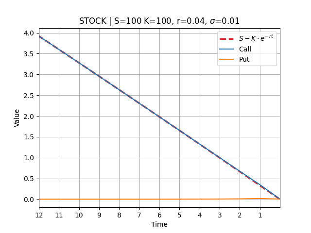
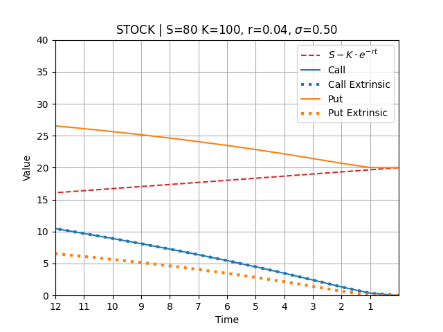
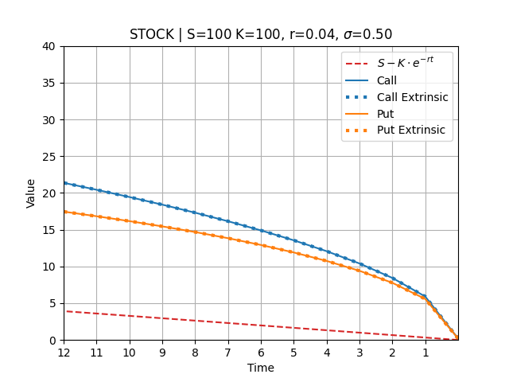
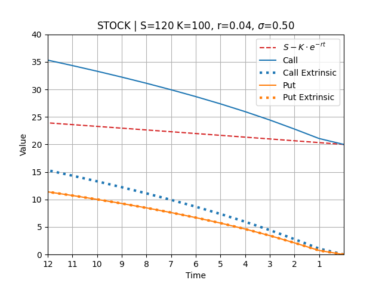
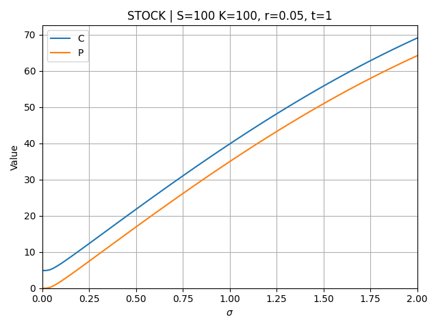
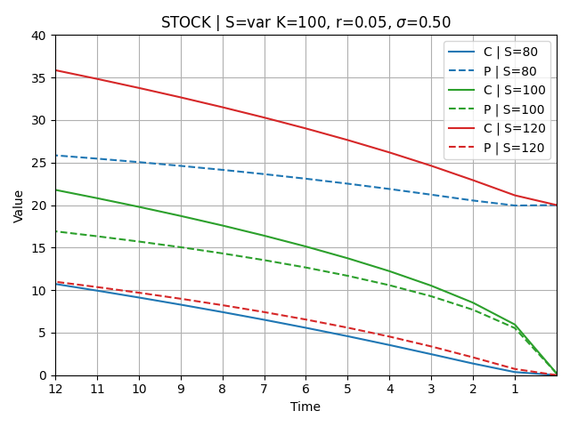
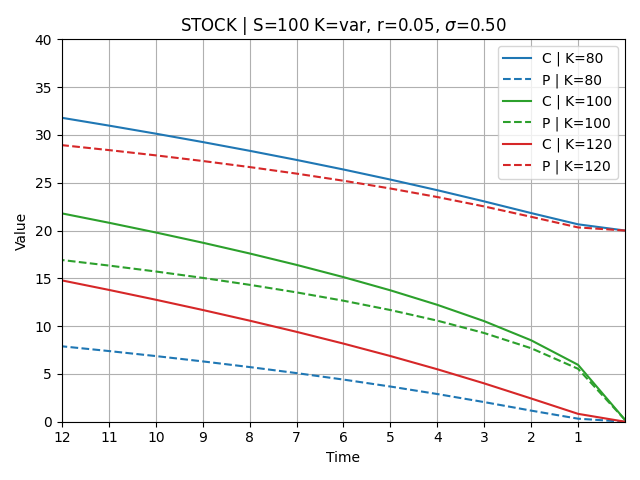
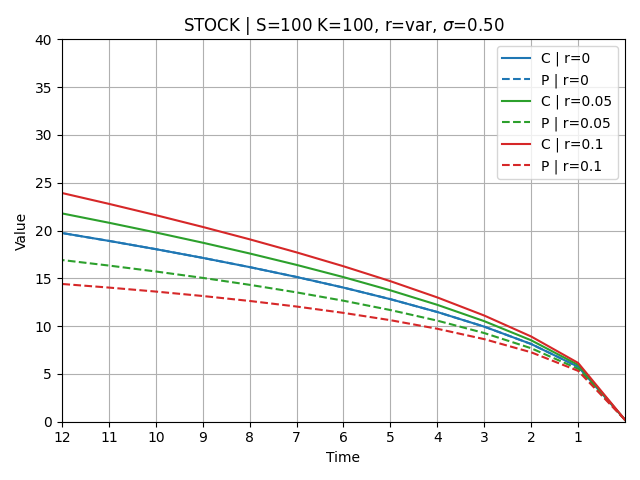
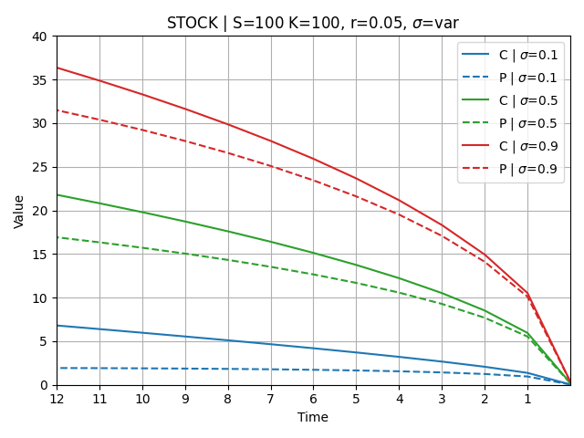
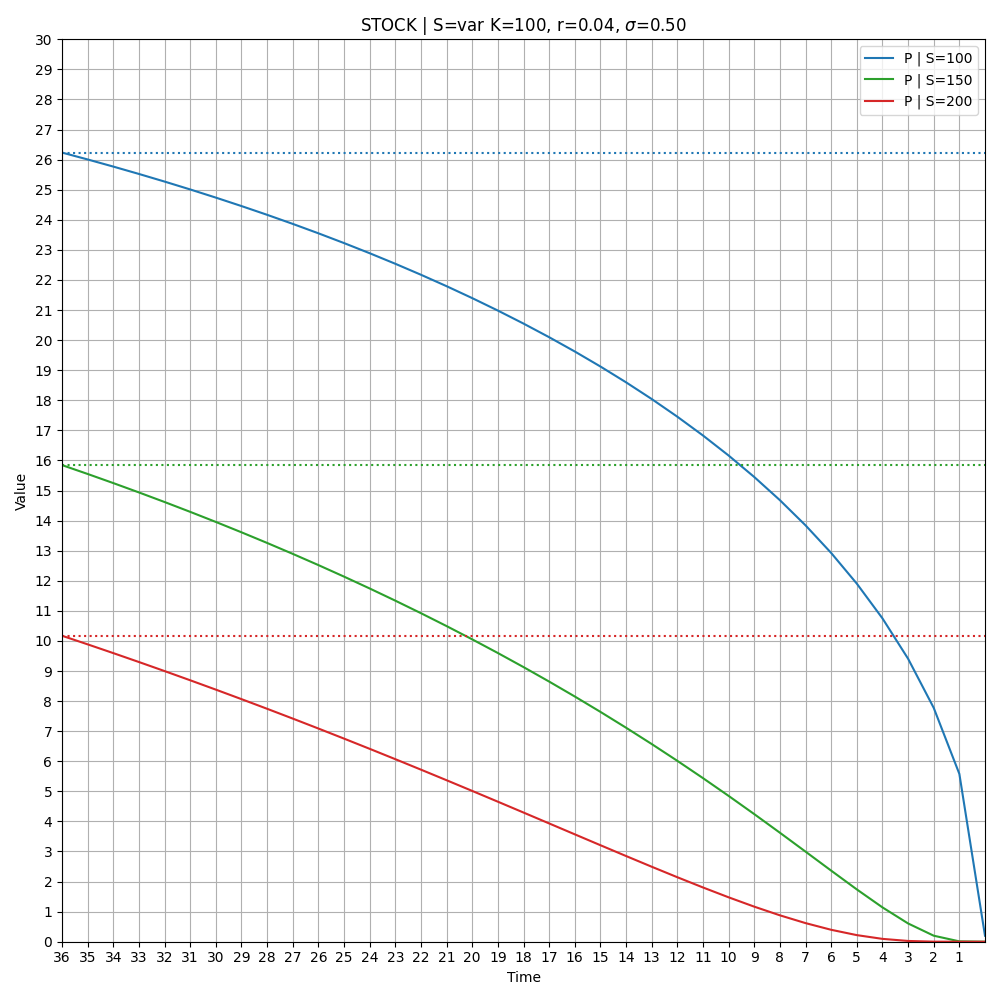

## Price change over time without volatility

Given:  
A: _current_ owner of the asset, and _holds the asset_ until option expiry.  
B: _future_ owner of the asset, and _holds the bond_ required to buy the asset at option expiry.

Call
* B has the long call, which means B wants to buy the asset at expiry, so B has to pay for the rights.
* If A sold the asset today in exchange for the bond, then A would get the bond returns.
* Since A holds the asset until option expiry, and B earns the bond returns, A has to be paid for the "lost" bond returns. B pays A, and makes a notional "loss" of the bond returns.

Put
* A has the long put, which means A wants to sell the asset at expiry, so A has to pay for the rights.
* As B already holds the bond until expiry, B would get the bond returns.
* Since A holds the asset until option expiry, and B earns the bond returns, B does not have to be paid. A "pays" B with a notional "loss" of the bond returns by not having the bond.

## Price change over time with volatility

| Call = OTM, Put = ITM | Call = ATM, Put = ATM | Call = ITM, Put = OTM |
|:---:|:---:|:---:|
|  |  |  |

## Price sensitivity to volatility

## Price change over time with $S$, $K$, $r$, $\sigma$ changes

| $S_{var}$ |  $K_{var}$ |
|:---:|:---:|
|  |  |

| $r_{var}$ | $\sigma_{var}$ |
|:---:|:---:|
|  |  |

## OTM Puts

