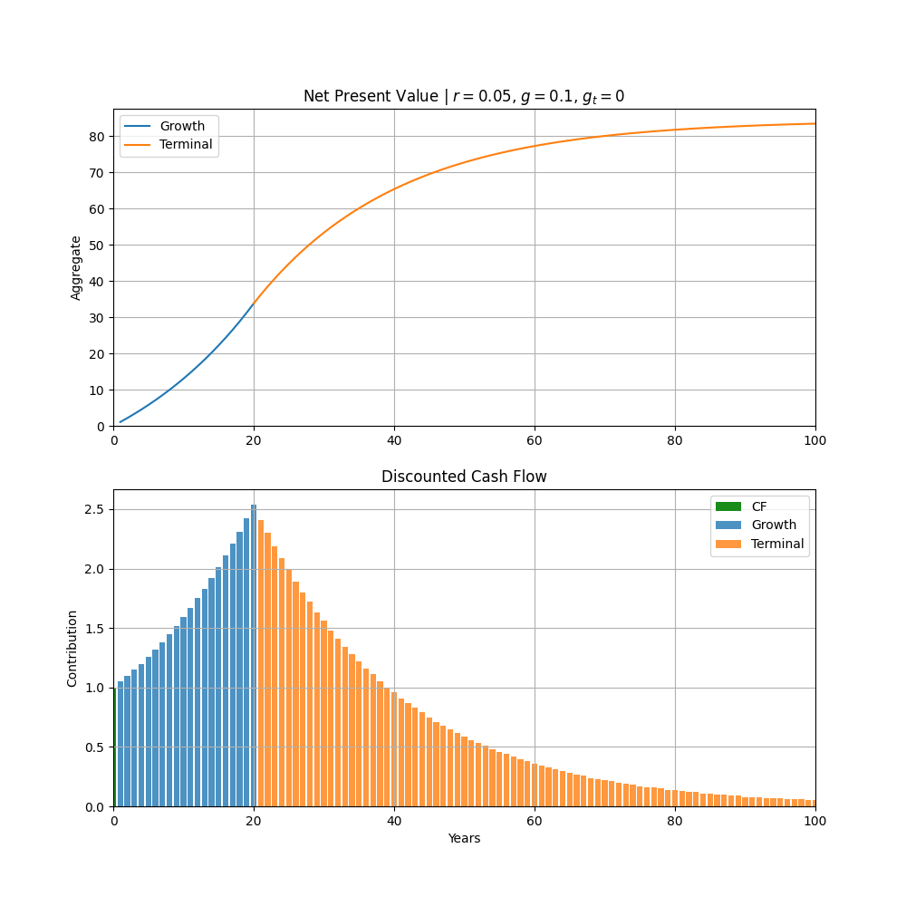

# Net Present Value

$\text{NPV} = \text{PV}(CF) + \text{PV}(TV)$

Given:
* $g_f$ = growth rate in decimal during forecast phase
* $g_t$ = growth rate in decimal during terminal phase
* $g_t < g_f$

$\text{PV}(CF) = CF_0 \times \sum_{t=1}^{n} \frac{(1 + g_f)^t}{(1 + r)^t}$

$\text{PV}(TV) = CF_n \times \sum_{t=n+1}^{\infty} \frac{(1 + g_t)^t}{(1 + r)^t}$

$\text{NPV} = CF_0 \times \sum_{t=1}^{n} \frac{(1 + g_f)^t}{(1 + r)^t} + CF_n \times \sum_{t=n+1}^{\infty} \frac{(1 + g_t)^t}{(1 + r)^t}$

