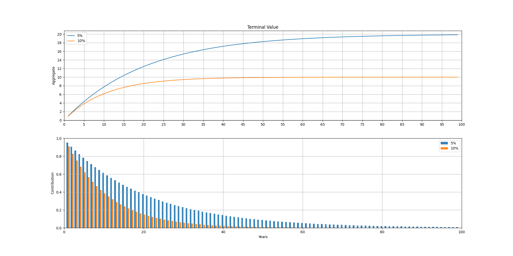

# Terminal Value

$\text{TV} = CF_n \times \frac{1 + g}{r -g}$

Assuming:  

$g = 0$, zero growth rate  
$CF_n = 1$, unit cashflow

Then:  

$\text{TV} = \frac{1}{r}$

## Example
For $5$% discount rate, $r=0.05$, $`\text{TV} = \frac{1}{0.05} \Rightarrow \boxed{\text{TV} = 20}`$

For $10$% discount rate, $r=0.1$, $`\text{TV} = \frac{1}{0.1} \Rightarrow \boxed{\text{TV} = 10}`$

